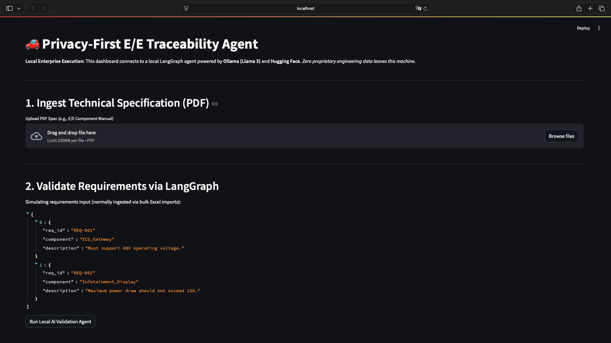
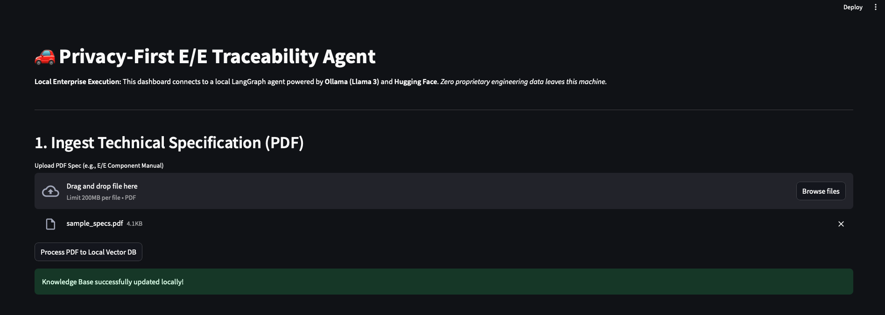
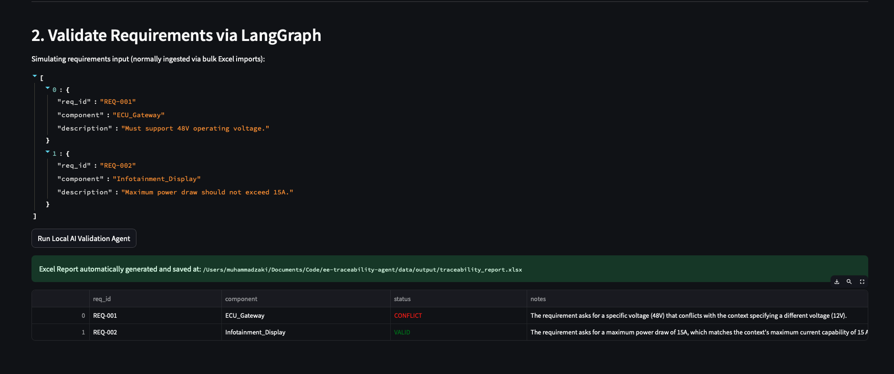

# 🚗 Privacy-First Automotive E/E Traceability Agent

An Agentic AI application built for automotive engineering workflows. This system utilizes **LangGraph** and **Retrieval-Augmented Generation (RAG)** to automate the validation of Electrical/Electronic (E/E) requirements against technical specifications, outputting results directly into automated **Excel** traceability matrices.

Crucially, this system is **100% localized and open-source**. It uses **Ollama (Llama 3)** and **Hugging Face** embeddings to ensure zero proprietary engineering data is transmitted to third-party cloud providers, strictly adhering to enterprise data security standards.

---

## 📸 Live Application Demo

### 1. Dashboard Overview
A secure, locally hosted Streamlit interface built for systems engineers to interact with the LangGraph validation agent.



### 2. Ingesting Technical Specifications (RAG)
The system securely processes proprietary automotive PDF manuals into a local ChromaDB vector store, ensuring IP remains on-premise.



### 3. LangGraph Agent Validation & Logic Checking
The AI agent evaluates functional requirements (e.g., operating voltage, current draw) against the ingested context and logically flags component mismatches, generating detailed engineering notes.



---

## 🎯 Business Motivation
In on-board network systems engineering, manually checking thousands of functional requirements (often managed in Excel) against large supplier PDF specifications creates traceability gaps and human error. This project automates engineering validation using local GenAI to significantly speed up the E/E requirement verification process.

## 🏗️ Architecture & Tech Stack
- **AI Models**: Ollama (Llama 3 local inference), Hugging Face (`all-MiniLM-L6-v2` embeddings)
- **Orchestration**: LangGraph (Stateful multi-step agent workflow), LangChain
- **Vector DB**: ChromaDB (local persistent storage)
- **Data Processing**: Python (`openpyxl`, `pandas`, `pypdf`)
- **Backend**: FastAPI
- **Frontend**: Streamlit

---

## ⚙️ Setup & Installation

### 1. Install Ollama & Pull the Local Model
Download and install [Ollama](https://ollama.com/), then pull the Llama 3 model:

```bash
ollama pull llama3
ollama serve
```

### 2. Clone the Repository

```bash
git clone https://github.com/yourusername/ee-traceability-agent.git
cd ee-traceability-agent
```

### 3. Create a Virtual Environment & Install Dependencies

```bash
python -m venv .venv
source .venv/bin/activate  # On Windows use: .venv\Scripts\activate
pip install -r requirements.txt
```

---

## 🚀 Usage
This application runs as a decoupled backend/frontend system. Open two terminal windows.

### 1. Start the FastAPI Backend Service

```bash
uvicorn src.api:app --reload
```

### 2. Launch the Streamlit UI

```bash
streamlit run app.py
```

Open `http://localhost:8501` in your browser, upload a technical PDF specification, and trigger the validation agent. The application will generate an automated Excel traceability report.

---

## 📁 Output
The generated traceability report is saved in:

```text
data/output/traceability_report.xlsx
```

---

## 📝 Notes
- Replace placeholder images in `assets/` with real dashboard screenshots if desired.
- Ensure `data/output/` exists and is writable by the application.
- Adjust the model/embedding configuration to match your local Ollama and ChromaDB setup.
- Add real project documentation and sample data files for production use.

---

## 🧩 Recommended Enhancements
- Add `langgraph`, `chromadb`, and related dependencies to `requirements.txt` if used.
- Add a sample ingestion pipeline for PDF parsing and Excel export.
- Add unit tests for `src/document_parser.py`, `src/excel_exporter.py`, and the API endpoints.
