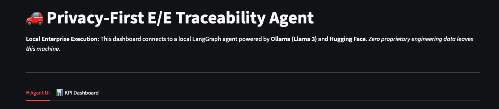
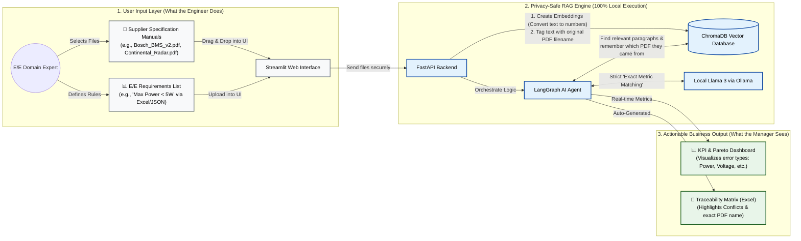
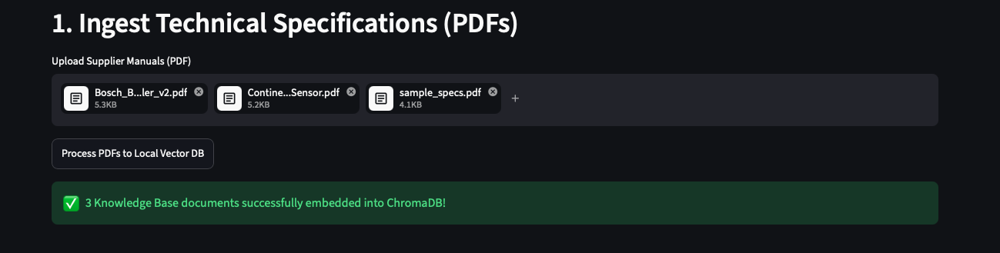
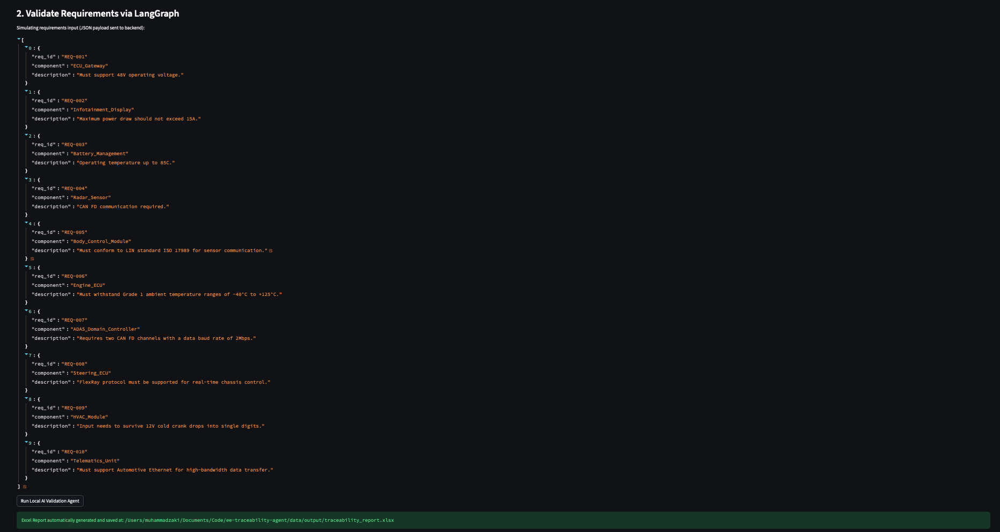
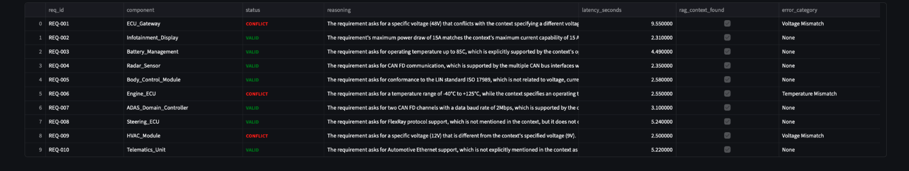
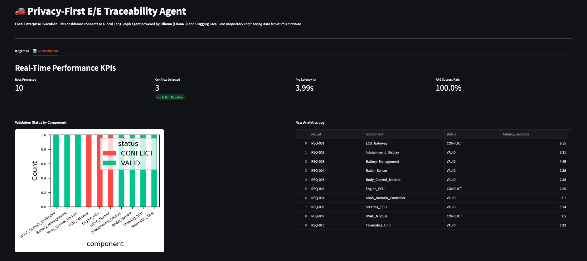
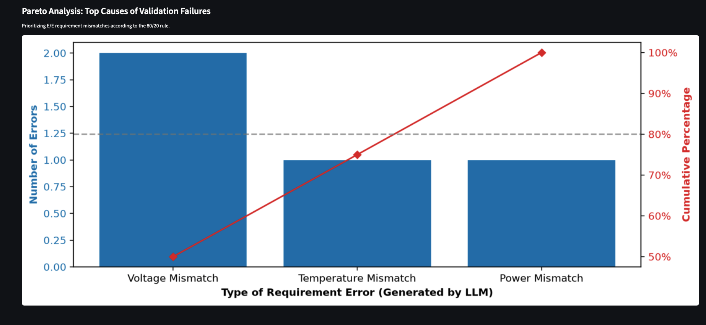

# 🚗 Privacy-First Automotive E/E Traceability Agent

## 🖥️ Dashboard Overview
The application is split into two main tabs to separate the engineering workflow from the management analytics:

* **🤖 Agent UI (Tab 1):** The control center. This is where engineers upload PDF manuals, input requirements, and trigger the local LangGraph AI to perform validations.
* **📊 KPI Dashboard (Tab 2):** The reporting center. This is where engineering managers can view real-time metrics, track latency, and view Pareto charts to prioritize which requirement conflicts to fix first.


---

## 🎯 Project Overview
This tool is a local AI agent designed for On-Board Network Systems & Functions team. It automates the tedious process of cross-referencing hundreds of hardware requirements against massive supplier PDF manuals. 

**Privacy-First:** Because automotive data is highly confidential, this entire AI pipeline runs 100% locally on your machine. No engineering data is ever sent to the cloud (OpenAI, Google, etc.).

---


## 🏗️ Simple System Architecture

This diagram shows how the information flows through the local agent without ever leaving your computer:


## 🚀 How to Use the App (Step-by-Step)

When you open the application, you will start in the **Agent UI** tab. Follow these steps, which match exactly with the numbering on your screen:

### Step 1: Ingest Technical Specification (PDF)
*(Matches "1. Ingest Technical Specification" in the UI)*

Before the AI can check your requirements, it needs to read the manual. 
* Click **Browse files** and upload an engineering PDF.
* Click **Process PDF to Local Vector DB**.
* *What happens behind the scenes:* The AI reads the document and securely stores it in a local database so it can instantly recall specific technical specs later.



### Step 2: Validate Requirements
*(Matches "2. Validate Requirements via LangGraph" in the UI)*

Now that the AI knows the manual, you can test your requirements against it.
* Review the JSON payload containing the requirements you want to test (e.g., Voltage limits, CAN bus protocols).
* Click **Run Local AI Validation Agent**.
* *What happens behind the scenes:* The AI acts as an engineering validator. It compares each requirement to the PDF, flags any conflicts, and automatically generates an Excel Traceability Matrix report.


*Above: Submitting the engineering requirements.*


*Above: The AI automatically cross-references and flags conflicts.*

### Step 3: Review the KPI Dashboard
Once the AI finishes running, click over to the **📊 KPI Dashboard** tab at the top of the screen to view the results.
* **Top Metrics:** Instantly see how many requirements were processed and how many conflicts require manual engineering review.
* **Pareto Analysis:** A dynamic chart automatically sorts the errors by category (e.g., "Voltage Mismatch"). Following the 80/20 rule, this tells engineering managers exactly which category of errors they should focus on fixing first to resolve the majority of system conflicts.


*Above: High-level metrics tracking processing volume and AI latency.*


*Above: The 80/20 Pareto chart prioritizing the most frequent requirement errors.*

---

## 🎯 Business Motivation
In on-board network systems engineering, manually checking thousands of functional requirements (often managed in Excel) against massive supplier PDF specifications leads to traceability gaps and human error. This project acts as an automated engineering assistant to validate power, communication, and hardware constraints using GenAI, significantly accelerating the engineering pipeline.

## 🏗️ Architecture & Tech Stack
- **AI Models**: Ollama (Llama 3 local inference), Hugging Face (`all-MiniLM-L6-v2` embeddings)
- **Orchestration**: LangGraph (Stateful multi-step agent workflow), LangChain
- **Vector DB**: ChromaDB (Local persistent storage)
- **Data Processing & Analytics**: Python (`pandas`, `matplotlib`, `openpyxl`, `pypdf`) for dashboarding and automated Excel KPI generation
- **Backend & UI**: FastAPI, Streamlit

---

## 🎯 Business Motivation
In on-board network systems engineering, manually checking thousands of functional requirements (often managed in Excel) against massive supplier PDF specifications leads to traceability gaps and human error. This project acts as an automated engineering assistant to validate power, communication, and hardware constraints using GenAI, significantly accelerating the engineering pipeline.

## 🏗️ Architecture & Tech Stack
- **AI Models**: Ollama (Llama 3 local inference), Hugging Face (`all-MiniLM-L6-v2` embeddings)
- **Orchestration**: LangGraph (Stateful multi-step agent workflow), LangChain
- **Vector DB**: ChromaDB (Local persistent storage)
- **Data Processing & Automation**: Python (`openpyxl`, `pandas`, `pypdf`) for automated Excel KPI generation
- **Backend & UI**: FastAPI, Streamlit

---

## ⚙️ Setup & Installation

**1. Install Ollama & Pull the Local Model:**
Download and install [Ollama](https://ollama.com/), then pull the Llama 3 model to your local machine:
```bash

ollama pull llama3
ollama serve
```


**2. Clone the Repository & Install Dependencies:**
```bash
git clone [https://github.com/yourusername/ee-traceability-agent.git](https://github.com/yourusername/ee-traceability-agent.git)
cd ee-traceability-agent
pip install -r requirements.txt

```

**3. Start the FastAPI Backend:**
```bash
uvicorn src.api:app --reload
```

**3. Launch the Streamlit Dashboard:**
```bash
Open a new terminal window and run:
streamlit run app.py
```

```

graph TD
    %% Styling
    classDef input fill:#e1f5fe,stroke:#03a9f4,stroke-width:2px,color:#000
    classDef privacy fill:#e8f5e9,stroke:#4caf50,stroke-width:2px,color:#000
    classDef output fill:#fff3e0,stroke:#ff9800,stroke-width:2px,color:#000
    classDef agent fill:#f3e5f5,stroke:#9c27b0,stroke-width:2px,color:#000

    subgraph Input ["(A) Engineer Inputs"]
        PDF["📄 Supplier Manual (PDF)"]:::input
        REQ["📋 Requirements (JSON)"]:::input
    end

    subgraph LocalZone ["(B) Privacy Zone: 100% Local Machine 🔒"]
        UI["💻 Streamlit / FastAPI UI"]:::agent
        Agent["🤖 LangGraph AI Agent (The Brain)"]:::agent
        DB["🗄️ ChromaDB (Local Vector DB) 🔒"]:::privacy
        LLM["🧠 Ollama (Local Llama 3) 🔒"]:::privacy

        UI -->|Triggers validation| Agent
        Agent <-->|Retrieves context| DB
        Agent <-->|Analyzes rules| LLM
    end

    subgraph Output ["(C) Deliverables"]
        Dash["📊 Manager KPI Dashboard"]:::output
        Excel["📗 Excel Traceability Matrix"]:::output
    end

    PDF -->|Uploaded to| UI
    REQ -->|Uploaded to| UI
    Agent -->|Renders| Dash
    Agent -->|Exports| Excel
