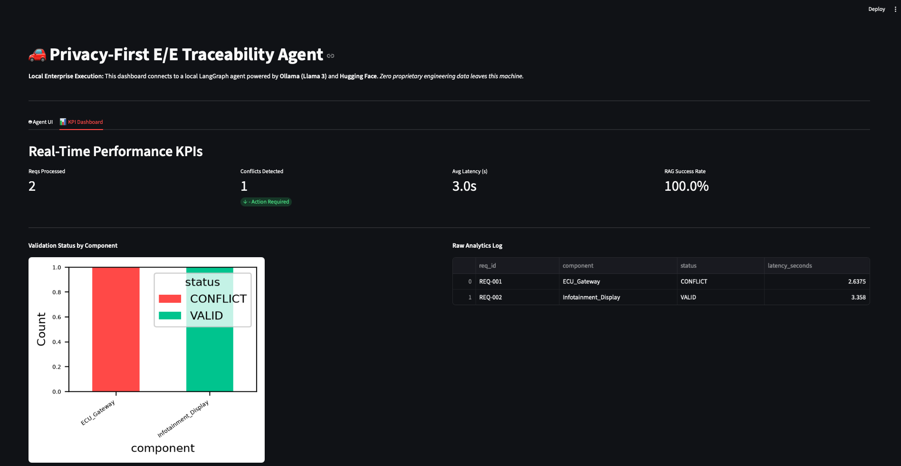

# 🚗 Privacy-First Automotive E/E Traceability Agent

An Agentic AI application built for automotive engineering workflows. This system utilizes **LangGraph** and **Retrieval-Augmented Generation (RAG)** to automate the validation of Electrical/Electronic (E/E) requirements against technical specifications, outputting results directly into automated **Excel** traceability matrices and visualizing real-time telemetry.

Crucially, this system is **100% localized and open-source**. It uses **Ollama (Llama 3)** and **Hugging Face** embeddings to ensure zero proprietary engineering data is transmitted to third-party cloud providers, strictly adhering to enterprise data security standards.

---

## 📸 Live Application Demo

### 1. Dashboard Overview
A secure, locally hosted Streamlit interface built for systems engineers to interact with the LangGraph validation agent.


### 2. Ingesting Technical Specifications (RAG)
The system securely processes proprietary automotive PDF manuals into a local ChromaDB vector store, ensuring IP remains on-premise.


### 3. LangGraph Agent Validation & Logic Checking
The AI agent evaluates functional requirements (e.g., operating voltage, current draw) against the ingested context and logically flags component mismatches, generating detailed engineering notes.


### 4. Real-Time KPI Dashboard
Built-in telemetry visualizes engineering KPIs (Requirements Processed, Conflict Detection Rate) and AI performance metrics (Validation Latency, RAG Success) using Pandas and Matplotlib.
 *(Note: Replace with your actual dashboard screenshot filename)*

---

## 🎯 Business Motivation
In on-board network systems engineering, manually checking thousands of functional requirements (often managed in Excel) against massive supplier PDF specifications leads to traceability gaps and human error. This project acts as an automated engineering assistant to validate power, communication, and hardware constraints using GenAI, significantly accelerating the engineering pipeline.

## 🏗️ Architecture & Tech Stack
- **AI Models**: Ollama (Llama 3 local inference), Hugging Face (`all-MiniLM-L6-v2` embeddings)
- **Orchestration**: LangGraph (Stateful multi-step agent workflow), LangChain
- **Vector DB**: ChromaDB (Local persistent storage)
- **Data Processing & Analytics**: Python (`pandas`, `matplotlib`, `openpyxl`, `pypdf`) for dashboarding and automated Excel KPI generation
- **Backend & UI**: FastAPI, Streamlit

---

## 🎯 Business Motivation
In on-board network systems engineering, manually checking thousands of functional requirements (often managed in Excel) against massive supplier PDF specifications leads to traceability gaps and human error. This project acts as an automated engineering assistant to validate power, communication, and hardware constraints using GenAI, significantly accelerating the engineering pipeline.

## 🏗️ Architecture & Tech Stack
- **AI Models**: Ollama (Llama 3 local inference), Hugging Face (`all-MiniLM-L6-v2` embeddings)
- **Orchestration**: LangGraph (Stateful multi-step agent workflow), LangChain
- **Vector DB**: ChromaDB (Local persistent storage)
- **Data Processing & Automation**: Python (`openpyxl`, `pandas`, `pypdf`) for automated Excel KPI generation
- **Backend & UI**: FastAPI, Streamlit

---

## ⚙️ Setup & Installation

**1. Install Ollama & Pull the Local Model:**
Download and install [Ollama](https://ollama.com/), then pull the Llama 3 model to your local machine:
```bash

ollama pull llama3
ollama serve
```


**2. Clone the Repository & Install Dependencies:**
```bash
git clone [https://github.com/yourusername/ee-traceability-agent.git](https://github.com/yourusername/ee-traceability-agent.git)
cd ee-traceability-agent
pip install -r requirements.txt

```

**3. Start the FastAPI Backend:**
```bash
uvicorn src.api:app --reload
```

**3. Launch the Streamlit Dashboard:**
```bash
Open a new terminal window and run:
streamlit run app.py
```
